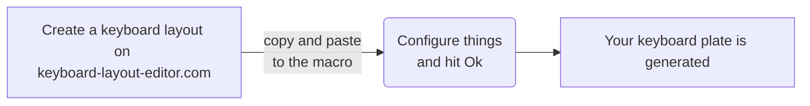
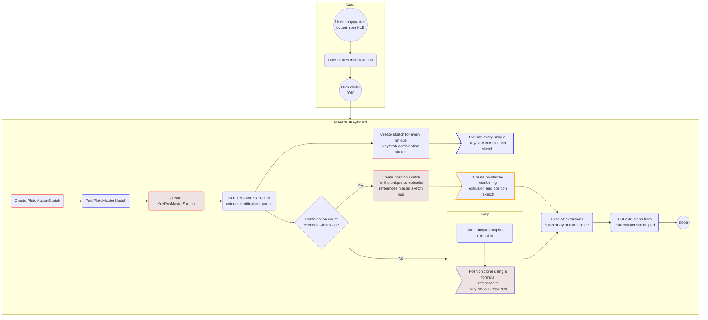

# KeyboardGenerator
KeyboardGenerator is a macro for the open-source parametric 3D modeler FreeCAD. Although it doesn't quite generate a whole keyboard (not yet at least). It does make it a lot less tedious. 
Save yourself the effort of having to place every single key by hand and applying all the needed constraints by just creating your layout on [keyboard-layout-editor.com](https://www.keyboard-layout-editor.com) and feeding it to the macro. It will do the tedious work for you!

## How to use
### Installation
1. Download the entire project and copy it to your FreeCAD macro folder 
	* For Windows  
		* `%AppData%\Roaming\FreeCAD\Macro`
	* For Linux (and Mac?):
		* `~/.FreeCAD/Macro/`
	* If you're having trouble finding it, in FreeCAD go to `Edit > Preferences > General > [tab] Macro` and it should be listed under `Macro Path`
2. Right click on the toolbar in FreeCAD and click 'Customize'
3. Go to the Macro tab
4. Select Keyboard Generator.fcmacro in the `macro` field and fill in the other fields as you see fit
	* You can add the kg-logo folder of the macro to FreeCADs icon path if you want to use my icon 
	
5. Click `Add`
* 
6. Switch to the `Toolbars` tab in the same window
7. On the right hand side select `global` in the dropdown
8. Click `new` and name the toolbar something (e.g. `keyboard`)
9. On the left hand side select `Macros` as the category (Note: the plural form, **not Macro without the s**)
10. Select `Keyboard Generator` and click the `move right` arrow in the middle
11. Close the window and on your toolbar should now be a new button that starts this macro

>**NOTE**
>Still lost? Perhaps the [FreeCAD wiki](https://wiki.freecad.org/Customize_Toolbars) does a better job at explaining it then I did.

### Usage
1. Create your layout on keyboard-layout-editor.com and go to the `Raw Data` tab.
2. Copy the JSON5 in the text field under this tab
3. Open this macro in FreeCAD and paste the JSON5 keyboard layout into the first text field
	* Optional: Make changes to any of the relevant form input controls
4. Hit `Ok` and watch FreeCAD do what it does.

>**NOTE**
> *For large keyboard layouts FreeCAD will Freeze for a few seconds, I believe this is due to the single threaded nature of the constraint resolver in sketcher. The more constraints in a single sketch the longer it takes, this seems to scale exponentially. 
> The key position master sketch will need a DistanceX and DistanceY constraint for every single key position. On a keyboard with 100 keys that's 200 constraints for key positioning alone.

## What doesn't work?
>**WARNING**
> * Stick to an ANSI layout (the ones where the enter/return key is just a rectangle).
>ANSI or JIT layouts with an oddly shaped return key are not supported. I couldn't find the specs for them and I don't use them myself. I don't know where to place the switch/stabilizers and they'd require a considerable amount of additional code.
>
> * Stepped keys don't work, adding support for it should be relatively easy but so is the workaround. Simply use a regular non-stepped key in the layout you give to the macro, as far as I know the switch positioning is the same. The only difference as far as I know is visual and this macro doesn't render keycaps in its output to begin with.
> 
> * Keyboard and key color schemes are ignored. I just added the preview including the keycaps as a quick sanity check to quickly show you've pasted the right layout. I didn't really intend for it to display everything exactly the same as KLE.
> 
*[KLE]: Keyboard Layout Editor (.com)

## Options
The main focus of the macro, the tab 'Keyboard Data'  allows you to set many different options allowing you to finetune what it will create. All fields are accompanied by a question mark button `?` that will take you to the relevant section of an integrated help file, similar to the descriptions below but in more detail. 

### Plate options
* Corner style
	* Pick from Rounded, Angled or Right angle
* Corner Radius [¹],[²]
	* Only available for the Rounded and Angled corner styles, it allows you to set a radius (in mm) to round or angle the corners as you please. 
	* Marking the 'per corner' checkbox unlocks setting each corner individually. You have the full freedom to style each corner as you please
	* *Single* vs *Separate (X&Y)*
		* *Single* - Apply the same X and Y radius allowing for perfectly symmetrical rounded or angled corners (two 45° bends for angled)
		* *Separate (X&Y)* 
			* Rounded corners can take an elliptical shape
			* Angled corners can have various slanted shapes
* Plate thickness
	* Normally the preview shows the keyboard but selecting this field will show a side profile of the plate with a preview of a switch. By default this field is set to 1.5mm following Cherry's specs.

> **Warning**
> [¹] Setting the corner radius to a high value can cause the switches and or stabilizers to overlap with the edge of the plate which is *very likely* something you want to avoid. To warn that this is happening the offending parts in the preview will be colored bright red.

> **Warning**
> [²] Setting extremely high values - to the point where the start point or end point of one corner overlaps with that of another corner will lead to errors in the generated Sketches. To warn you that this is happening the affected corners will be highlighted by a bright red block.

### Padding options
* Pad from
	* Reserved or Cutout
		* *Reserved* treats all keys as a 19.05mm* square and pads from there
		* *Cutout* will start the padding from whichever cutout (switch or stab) is closest to one of the sides
* Pad all by
	* Set the padding to be applied to all sides, or mark the checkbox to set it for each side individually. Useful to create space for knobs, touchpads, joycons, batteries, displays or whatever else you might want to add to your keyboard.
	* Per side checkbox 
		* As expected this will allow you set the padding for each side individually.
>**NOTE**
>*This 19.05mm spacing only applies when the Spacing option for cutouts is set to the the default 19.05mm, it can be changed to 19mm under Cutout options > Spacing

### Cutout options
* Switch
	* Pick from Cherry MX, Cherry MX Openable, Cherry MX+Alps hybrid and Alps
	* The `90° ↻` button will rotate all stabilized switches by 90°
		* Left clicking a stabilized switch in the preview will rotate the switch for just that key.
* Stabilizer
	* Pick from Cherry+Costar, Cherry, Costar and Alps
		* The alps stabilizer can only be selected if the Alps switch is selected in the switch dropdown.
	* The `180° ⮃` button will flip the stabilizer for all stabilized keys.
		* Right clicking a stabilized switch in the preview will rotate the stabilizer for just that key.
* Kerf
	* Kerf will 'shrink' the cutouts inwards to compensate for the cutting process going 'outside the lines' 
		* It's also possible to set this field to a negative value to grow the shape outwards, I figured this could be useful for 3D printing where the material might expand shrinking the cutouts.
* Spacing 
	* By default a '1u' key takes up 19.05mmx19.05mm square. This is based on the general convention for keyboards which in turn is based on ¾ inch typewriter spacing (¾ inch = 19.05mm).
	* The other selectable option is 19mm, as the difference is very minor it's unlikely to cause issues with keycaps colliding - some keyboards use this to work with nice round numbers.

### Other 
The keyboard preview shows the dimensions of the plate that will be generated along with arrows to illustrate where the measurement is done. 

At the bottom of the screen next to the `Ok` and `Cancel` buttons there are two tables to provide a quick overview of what you'll need to build the keyboard.
* One is titled 'Stabs' and provides an overview of which stab widths are used and how many of each width.
* The other is titled 'Keys' and lists how many keys are used (and thus how many switches will be needed).

Both tables are sectioned up in 'size' columns to indicate how easy/hard it is to get these parts. If the table isn't all green you might be in trouble.
*Green* = easy to get, *Orange* = rare and hard to get, *Red* = the stuff of legends, you'll have to scour the internet, *Bright red* = Impossible, you'll have to make it yourself or have someone else do it for you.

## Settings
KeyboardGenerator comes with its own settings that can be configured, these are found on the second tab aptly titled `Settings`
 1. Clone cap
	 * Determines the treshhold at which the macro should stop using positioned clones and start using a point array when generating the FreeCAD documents.
 2. Colors*
	 * The key cap, key cap side, keyboard plate and hover colors can be configured here 
 3. Reset 
	 * Deletes all custom settings resetting everything to their default.
 
 >**Note**
 > *The 'keyboard layout editor' input field uses the same colors as FreeCADs own code editor which you can set under: `Edit > Preferences > Editor`

## Supplemental Information/Credits
The third and last tab in the macro titled `Supplemental Information/Credits` provides an explanation of what the fields are and do along with you guessed it - the credits. There's also some random additional information that I found whilst trying to design a keyboard which I figured might come in handy for anyone else with the same aim.

## Top level overview of FreeCAD file generation

  
## Looking to contribute?
Here's a few simple guidelines.
* Use up to 80 characters per line where it makes sense, if it very negatively affects code readability feel free to deviate
* Use descriptive variable, class and method names
	* I value a clearly descriptive name like `__generateClonesAndPointArrays()` over `genClonePAs`, that's why I consider the character length more of a loose limit
* Use comments to clarify code intent where additional clarification is needed, don't name a method "createSketch()" and then add a comment above it "Creates a sketch" - the intent was already clear.
* Don't add massive external libraries and remember that Qt and all its classes are available
* Use American English - it's got the majority vote out here on the internet
	* ~The amount of times I've written colour instead of color and had to go back to edit it is beyond measure~ 

>**NOTE**
>I have gone out of my way rewriting large parts of the code to avoid having to rely on external libraries.
>* This is to avoid having to add multiple licenses 
>* This is to keep the macro fairly lightweight 
>* This is to avoid potentially malicious code

### Future ideas
Here's some ideas of what could be added to this macro. Please note that I'm unlikely to add these features myself as this macro has reached a point where it's usable for my own purpose and I have other things to do (like learning how to design a case, PCB and how to solder)

#### Relatively small implementations
1. Add support for stepped keys, for now anyone using this - just turn your stepped key into a regular key and switch placement should be okay.
2. The flipping of stabilizers and rotating of keys gets undone when changing the switch or key type. Making this change add a flag to the input field would prevent this. As an extra bonus It would allow users to import a layout with these settings pre-applied as well
	* https://kbplate.ai03.com/ already supports a `_rs` flag to set rotation of stabilizers so `_rs: 180` would make sense to have some form of cross compatibility.
3. Acoustic cutouts, the previously linked ai03 plate generator supports acoustic cutouts, how useful they are is open for debate but it might be of interest to some.
4. Importing colors straight from the input JSON - Technically keyboards have colors assigned to them already. Parsing the colors from the json and using those for the preview would make sense.
5. Improve legend overflow - currently long text on a key will simply overflow instead of going onto a new line
6. Dark mode themes should be fine, I think light themes should be fine for the most part but could probably do with additional tweaking

#### Big new features
1. Add support for L-shaped keys (the unusual ⏎ enter shapes)
	* I have no need for this myself and I couldn't find documentation on switch/stabilizer placement so I haven't implemented this but it's likely the #1 missing feature.
2. Create an entire case, similar to Swill's plate and case builder it should be possible to fully generate a 'sandwich' type of case
	* There's probably some kind of logic behind placing screw cutouts in an optimal or standardized way
3. "Edit mode", basically bring the functionality of keyboard-layout-editor.com into the macro, I'd highly recommend tackling *point #1*.
4. Add an option for non-rectangular plate  generation, instead of a simple rectangle follow the outline of the keys. I tried doing this by using a convex hull but couldn't really get it to make sense.
5. Mixed switch/stabilizer layouts, allow for per key assignment of the switch and stabilizer type. For example if someone only has enough Alp switches for the main part but wants to add a Cherry MX numpad.

## Credit
[hajimen's](https://github.com/hajimen/pykle_serial/) pykle_serial is used `(/KLE/serial.py)`* to serialize the keyboard JSON input. 
 
As with any other FreeCAD macro with a GUI, Qt is used. A big  thanks to The Qt Company for writing such a flexible framework, it's my first time using it and it's been enjoyable (for the most part).

Everything else can be credited to me (Axeia), including all the icons and images. 
* Admittedly  `/svgs/key-spacing.svg` is simply a modified SVGified version of an image found in [Matt3o's keyboard sizes guide](https://thegamingsetup.com/gaming-keyboard/buying-guides/keyboard-sizes)

>**NOTE**
> I have made no modifications to serial.py but the project by hajimen has a dependency listed for json5 and normally would use `import json5` to refer to [dpranke's json5 library](https://github.com/dpranke/pyjson5). Which is an awful lot of code and a different license to add to this project. 
> So instead I've placed a `json5.py` file in the same directory that simply uses some regular expressions and transforms the json5 into plain old json, this can then be used by pythons own json module.

### Mentions
The reason this project and many others exist is of course the keyboard-layout-editor.com site by [ijprest](https://github.com/ijprest/) which makes creating keyboard layouts easy and accessible. Early (non-publicized) versions of this macro were heavily inspired by [ijprest's pykle_serial](https://github.com/hajimen/pykle_serial/) but I have deviated from that greatly since then*.

>**NOTE**
> *For the curious a prototype version of this can be found [on my github](https://github.com/Axeia/Keyboard-Layout-Editor-SvgKeyboard) 

Most of the footprints for switches and stabilizers used by this macro were made whilst heavily leaning on [swill's work on the kb_builder](https://github.com/swill/kb_builder/). I've used his kb_builder a few times to see if the results line up with my own as a sanity check as well.

## Alternatives
Not into FreeCAD? Here's some alternatives I stumbled upon whilst making this macro.
* https://kbplate.ai03.com/
	* ai03 Plate Generator by [ai03-2725](https://github.com/ai03-2725)
* http://builder.swillkb.com/
	* Plate & Case builder by [swill](https://github.com/swill)
* https://plate.keeb.io/
	* Keyboard Plate Generator by  [Keebio](https://github.com/keebio)

## License
This macro and [hajimen's](https://github.com/hajimen/pykle_serial/) pykle_serial fall under the MIT license.